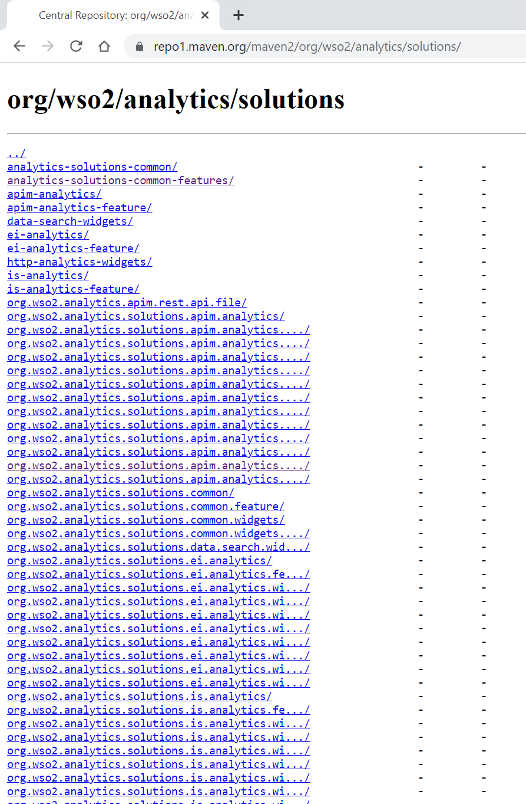
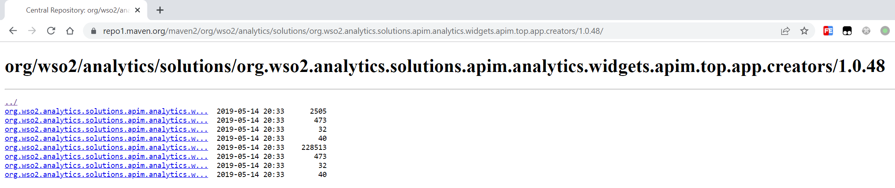
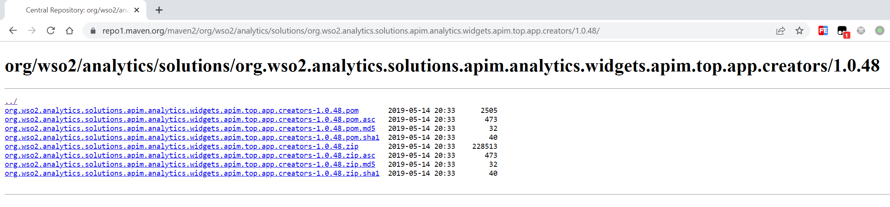

# maven油猴脚本

# 一、解决了什么问题？

我们有时会遇到要求Java项目兼容JDK 1.8的情况，有可能是部署时运行环境的要求，有可能是Java Agent类产品必须保证一定的JDK兼容性，有可能是领导或者甲方的诉求，总之我们只能接受这个要求没得选。

但是我们开发的时候可能会持续的增加一些依赖，对于Maven的这些Jar包，在Maven中央仓库是不显示Jar包具体是哪个JDK版本编译的，如果加错版本了可能我们的项目就无法运行了，因为JDK 1.8是无法加载解释JDK 1.9版本编译出来的Class文件的，则我们加依赖的时候就得小心翼翼，甚至可能得采取二分法试探出合适的版本（经历过的都能体会这是多么让人崩溃），而这个脚本就是用来解决这个问题的，它给Maven的中央仓库里的组件的版本增加了显示对应JDK版本的功能。


# 二、安装

从油猴商店安装：

https://greasyfork.org/zh-CN/scripts/471802-repo1-maven-org-helper

# 三、功能详细介绍

## 组件版本列表页展示每个版本Jar包的JDK版本

在组件的版本列表页面这里，增加了一列，展示每个版本具体的JDK编译信息：


JDK编译信息分为两部分，一部分是从Jar包中的每个class文件中分析出的编译版本：


比如上面的信息表示Jar包中共有178个class文件，其中177个是JDK 1.6版本编译的，而1个class是JDK 1.9版本编译的，这个时候如果想使用这个Jar包的话，比较保险的运行时JDK版本至少应该是1.9及以上。

还有一部分是从Jar包的`META-INF/MANIFEST.MF`文件中解析出来的编译元信息，这是因为虽然我们能够从Jar包中的每个class文件的编译版本分布情况推测出我们应该使用哪个JDK来运行此Jar包，但是有的时候Jar包编译的时候会往Jar包的``META-INF/MANIFEST.MF``中放一些元信息，其中可能就会有一些编译相关的元信息，这部分也可以作为参考（虽然实际加载解释class文件的时候只看class的文件头的编译版本，但不确定会不会有一些特殊情况是由元信息决定的最低运行JDK版本，所以把这个信息也放到这里作为参考）：


## 组件版本详情页展示编译JDK版本信息

在组件的详情页也展示了此组件的此版本是用哪个JDK版本编译的：


## GAV快速访问详情页

不开启脚本的情况： 


开启脚本之后会在页面底部增加几个输入框，在输入框中输入`GroupId`、`ArticleId`、`Version`之后单击`Go`按钮访问到对应的详情页：


比如这样，输入`fastjson`的`groupId`、`articleId`、`version`单击`Go`按钮可将当前页面定位到：

```
https://repo1.maven.org/maven2/com/alibaba/fastjson/2.0.9/
```


其中`ArticleId`和`Version`都是可以省略的，比如省略`Version`：


比如同时省略`ArticleId`和`Version`：


其中GroupId可以输入`com.alibaba:fastjson`的形式：


另外三个输入框都有历史输入记录。


## 展开因为过长而被隐藏的文本 

开启插件之前，可以看到文本超出部分都被隐藏了，当他们前缀相似的时候很难区分到底谁是谁：



开启插件之后，将被隐藏的文本显示全，同时保证布局不会乱掉（在某些窄屏可能会有问题，稍微宽一点的屏基本都没问题）：


在详情页未开启插件：



开启了插件之后：




