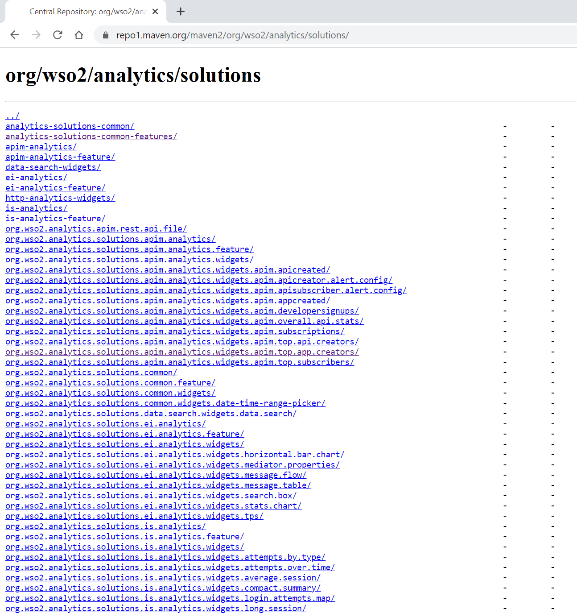

# repo1.maven.org Helper 油猴脚本

此脚本是为了提升[Maven中央仓库](https://repo1.maven.org/maven2)的使用体验。

从油猴商店安装：

https://greasyfork.org/zh-CN/scripts/471802-repo1-maven-org-helper

## 功能一：GAV快速访问详情页

不开启脚本的情况： 


开启脚本之后会在页面底部增加几个输入框，在输入框中输入`GroupId`、`ArticleId`、`Version`之后单击`Go`按钮访问到对应的详情页：


比如这样，输入`fastjson`的`groupId`、`articleId`、`version`单击`Go`按钮可将当前页面定位到：

```
https://repo1.maven.org/maven2/com/alibaba/fastjson/2.0.9/
```


其中`ArticleId`和`Version`都是可以省略的，比如省略`Version`：


比如同时省略`ArticleId`和`Version`：


其中GroupId可以输入`com.alibaba:fastjson`的形式：


另外三个输入框都有历史输入记录。


## 功能二：展开因为过长而被隐藏的文本 

开启插件之前，可以看到文本超出部分都被隐藏了，当他们前缀相似的时候很难区分到底谁是谁：


开启插件之后，将被隐藏的文本显示全，同时保证布局不会乱掉（在某些窄屏可能会有问题，稍微宽一点的屏基本都没问题）：



在详情页未开启插件：


开启了插件之后：


