# Maven Central Repository Greasemonkey Script

[简体中文](./README.md) | English

GitHub Repository: [https://github.com/scagogogo/mvnrepository-helper-UserScript](https://github.com/scagogogo/mvnrepository-helper-UserScript)

Introduction Video: [https://www.bilibili.com/video/BV13fkgYaEDn](https://www.bilibili.com/video/BV13fkgYaEDn)

                                           

# I. What Problem Does It Solve?

We sometimes encounter requirements for Java projects to be compatible with JDK 1.8. This could be due to the deployment environment's demands, the need for certain JDK compatibility in Java Agent products, or requests from management or clients. Regardless of whether these requirements are reasonable or not, we have no choice but to accept and implement them.

However, during development, we may continuously add dependencies. For these JAR packages in Maven, the Maven Central Repository does not display which specific JDK version was used to compile the JAR. If we add the wrong version, our project might not run because JDK 1.8 cannot load or interpret Class files compiled with JDK 1.9. Therefore, we must be cautious when adding dependencies, and we might even have to use a binary search method to find the suitable version (an experience that can be quite frustrating for those who have gone through it). This script is designed to solve this problem by adding functionality to display the corresponding JDK version for each component version in the Maven Central Repository. This allows us to select the appropriate version based on the JDK version we need to be compatible with.


# II. Installation

## 2.1 Install from Greasy Fork Store (Recommended Method)

First, you should have already installed the Tampermonkey extension:

[https://chromewebstore.google.com/detail/dhdgffkkebhmkfjojejmpbldmpobfkfo](https://chromewebstore.google.com/detail/dhdgffkkebhmkfjojejmpbldmpobfkfo)

Then, you can directly install this script from the Greasy Fork store:

[https://greasyfork.org/zh-CN/scripts/471802-repo1-maven-org-helper](https://greasyfork.org/zh-CN/scripts/471802-repo1-maven-org-helper)

## 2.2 Compile on Your Own

Clone the repository to your local machine:

```bash
git clone git@github.com:scagogogo/mvnrepository-helper-UserScript.git
```

Navigate to the cloned local directory:

```bash
cd mvnrepository-helper-UserScript
```

Install dependencies (using yarn):

```bash
yarn install
```

Or npm:

```bash
npm install
```

Then package the script (using yarn):

```bash
yarn build
```

Or npm:

```bash
npm run build
```

The packaged file will be in `dist/index.js`. You can create a new Tampermonkey script with the contents of `dist/index.js`.

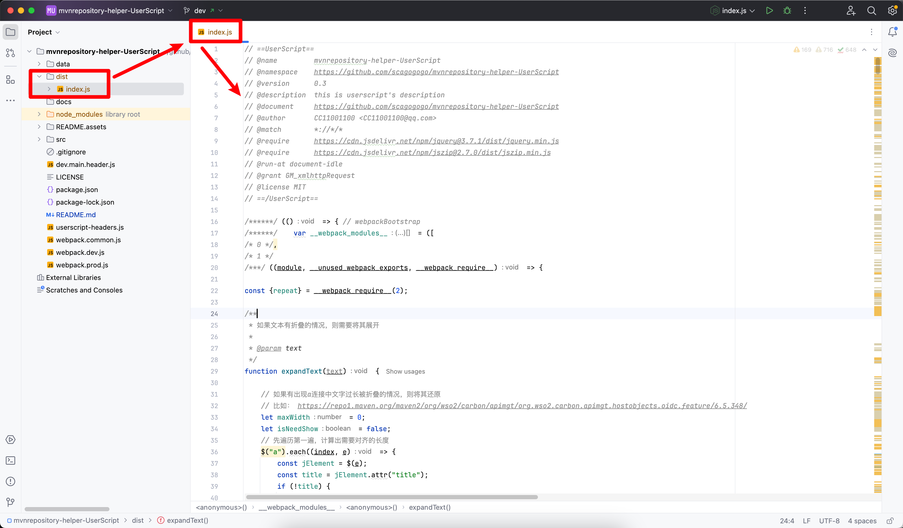
# III. Detailed Feature Introduction

## 3.1 Display JDK Version for Each Version's Jar Package on Component Version List Page

On the version list page of the component, an additional column has been added to display the specific JDK compilation information for each version of the component:

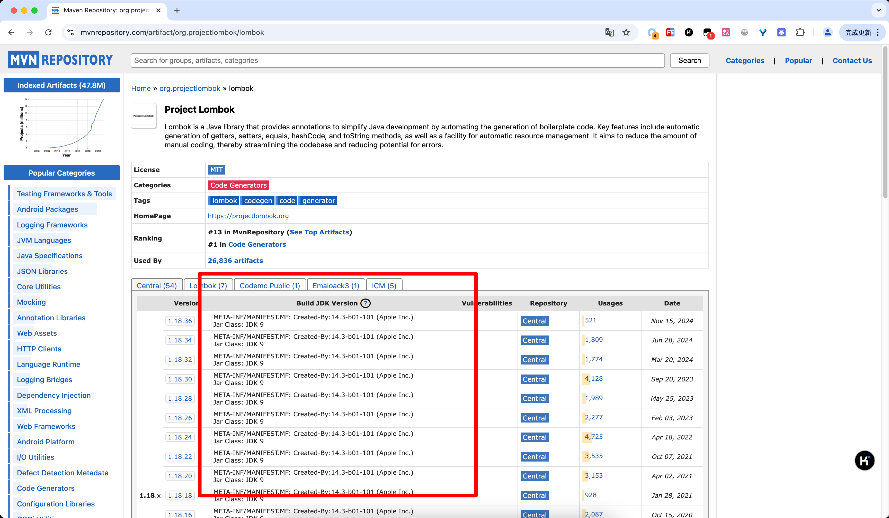

The JDK compilation information is divided into two parts. One part is the compilation version analyzed from each class file in the Jar package:

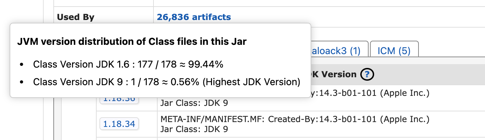

For example, the information above indicates that there are 178 class files in the Jar package, 177 of which are compiled with JDK 1.6, and 1 class is compiled with JDK 1.9. In this case, if you want to use this Jar package, the safer runtime JDK version should be at least 1.9 or higher.

The other part is the compilation metadata parsed from the `META-INF/MANIFEST.MF` file in the Jar package. This is because although we can infer the minimum JDK version required to run this Jar package from the distribution of compilation versions in each class file of the Jar package, sometimes the Jar package may include some metadata in the `META-INF/MANIFEST.MF` during compilation, which may include some compilation-related metadata. Although the actual loading and interpretation of class files only look at the compilation version in the file header, there is uncertainty about whether there are any special cases determined by metadata for the minimum runtime JDK version, so this information is also provided here for reference:

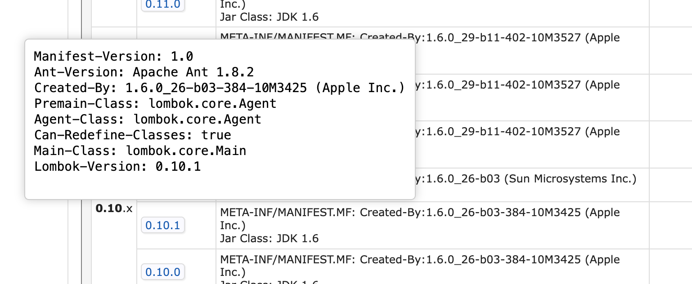

## 3.2 Display Compilation JDK Version Information on Component Version Detail Page

The detail page of the component also displays which JDK version was used to compile this version of the component:

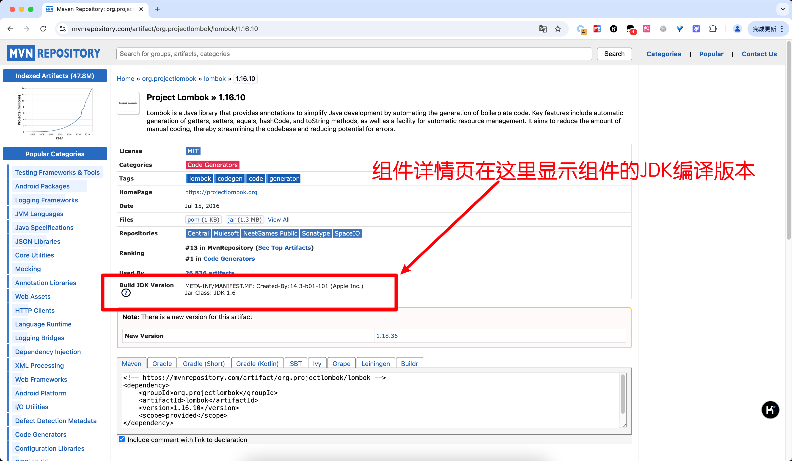

## 3.3 Quick Access to Detail Page with GAV

Without enabling the script:

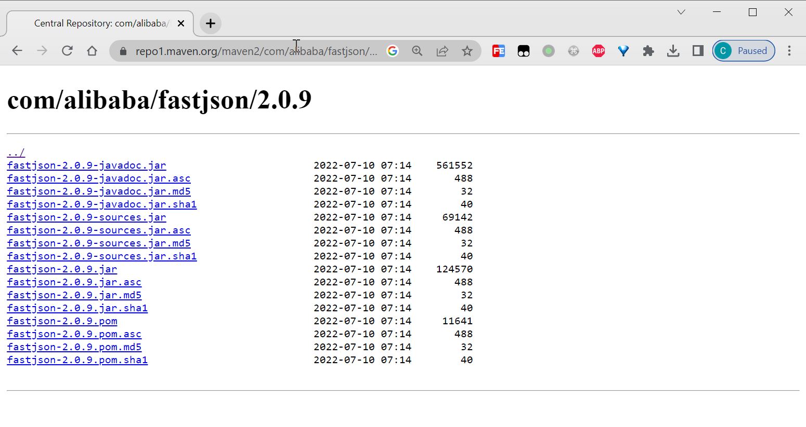

After enabling the script, several input boxes will be added at the bottom of the page. By entering `GroupId`, `ArtifactId`, `Version` in the input boxes and clicking the `Go` button, you can access the corresponding detail page:

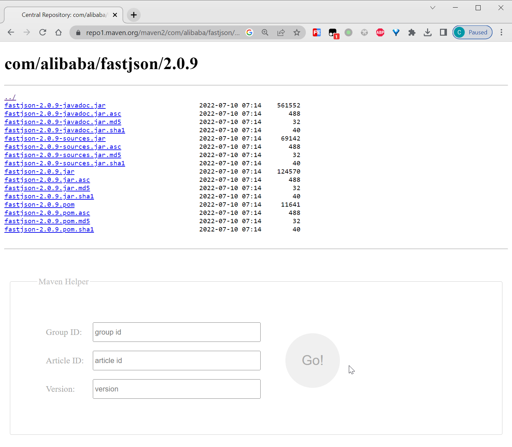

For example, by entering the `groupId`, `artifactId`, `version` of `fastjson` and clicking the `Go` button, the current page will be positioned to:

```plaintext
https://repo1.maven.org/maven2/com/alibaba/fastjson/2.0.9/
```

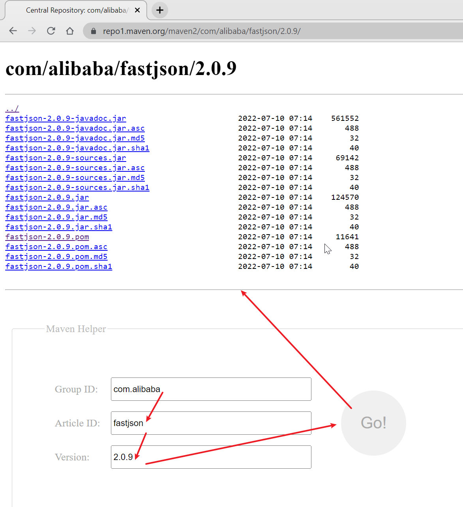

Both `ArtifactId` and `Version` can be omitted, for example, omitting `Version`:

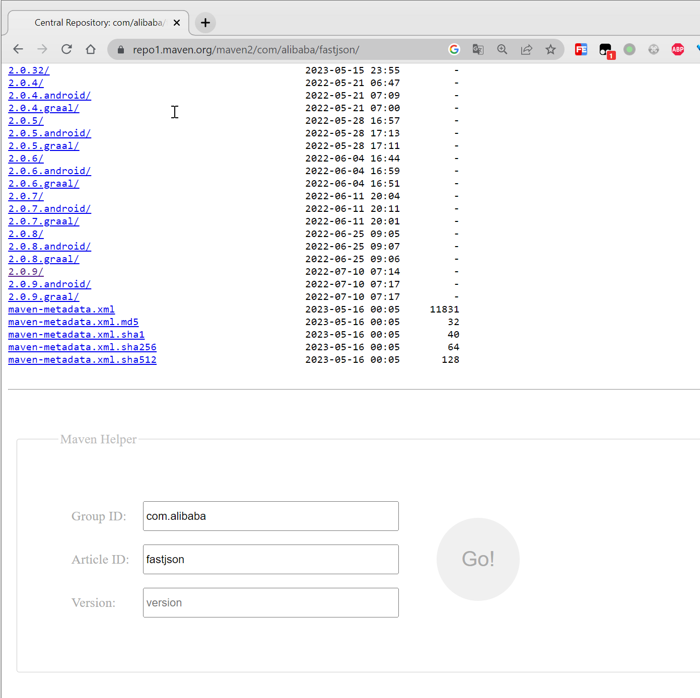

For example, omitting both `ArtifactId` and `Version`:

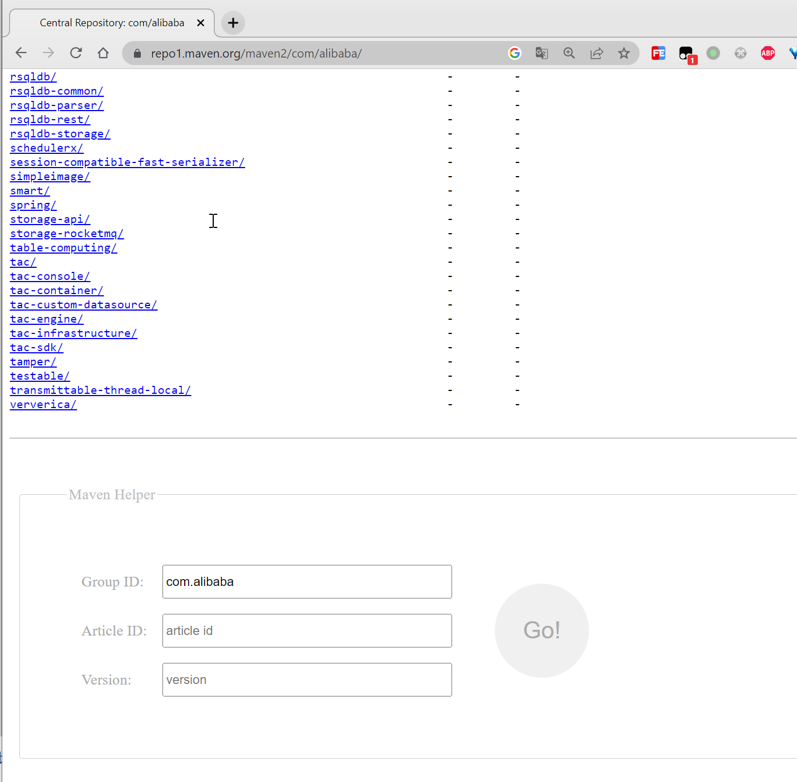

The `GroupId` can also be entered in the form of `com.alibaba:fastjson`:

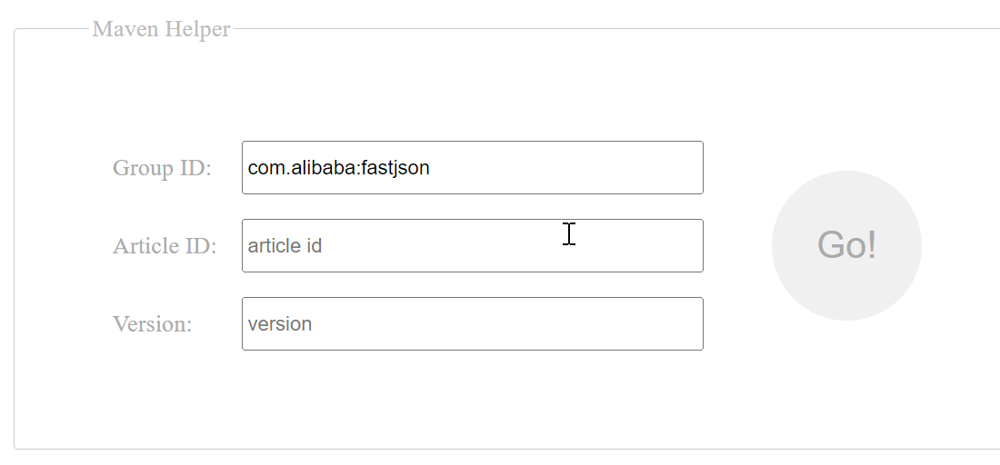

Additionally, all three input boxes have a history of inputs.

## 3.4 Expand Text Hidden Due to Length

Before enabling the plugin, it can be seen that the超出部分 of the text is hidden, and when their prefixes are similar, it is difficult to distinguish who is who:


After enabling the plugin, the hidden text is fully displayed while ensuring that the layout does not become disordered (there may be issues on some narrow screens, but it is basically fine on slightly wider screens):

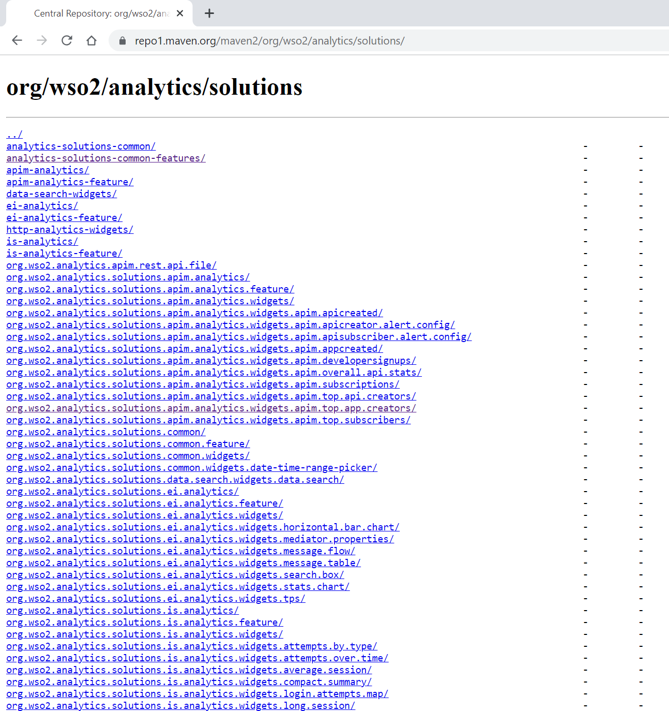

On the detail page without enabling the plugin:

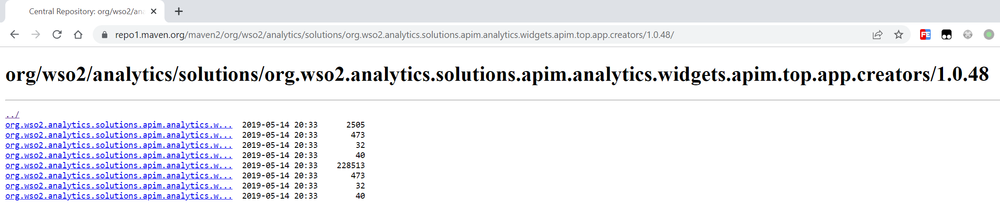

After enabling the plugin:

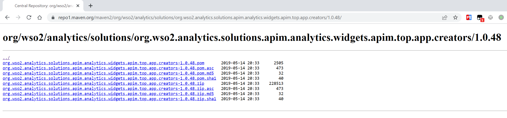

# 四、FAQ


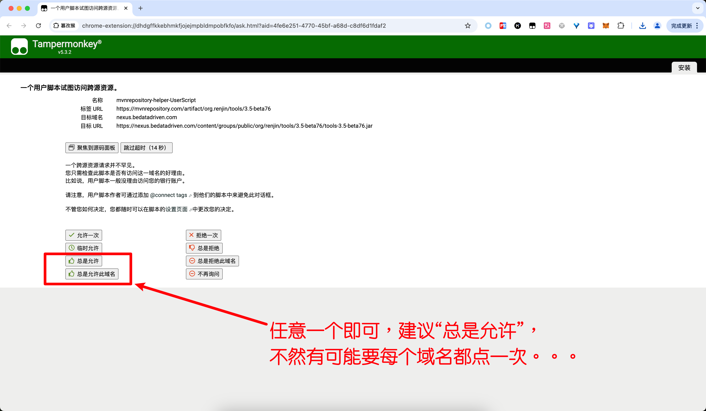


# 五、Contributors


# 六、Star History


